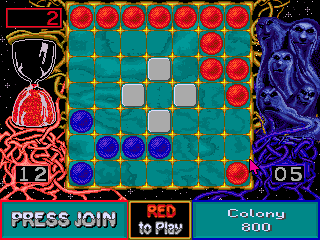

# Assegnazione Progetto

## ATAXX

Le regole del gioco sono le seguenti:
* si gioca su una griglia 7x7;
* partecipatono due giocatori: uno rosso e uno blu;
* ogni giocatore comincia con due pezzi:
    * i pezzi rossi si trovano nell'angolo in alto a sinistra e nell'angolo in basso a destra;
    * i pezzi blu si trovano nell'angolo in alto a destra e nell'angolo in basso a sinistra.
* a turno, i giocatori spostano uno dei loro pezzi di una o due caselle in qualsiasi direzione.
    1. se la casella di destinazione è adiacente a quella di origine allora il pezzo viene duplicato, altrimenti viene solo spostato;
    2. dopo la mossa, tutti i pezzi dell'altro giocatore adiacenti alla casella di destinazione vengono convertiti nel colore del giocatore che ha fatto la mossa.
* il gioco finisce quando tutte le caselle sono state riempite o quando un giocatore non ha più pezzi. Vince il giocatore con più pezzi.
